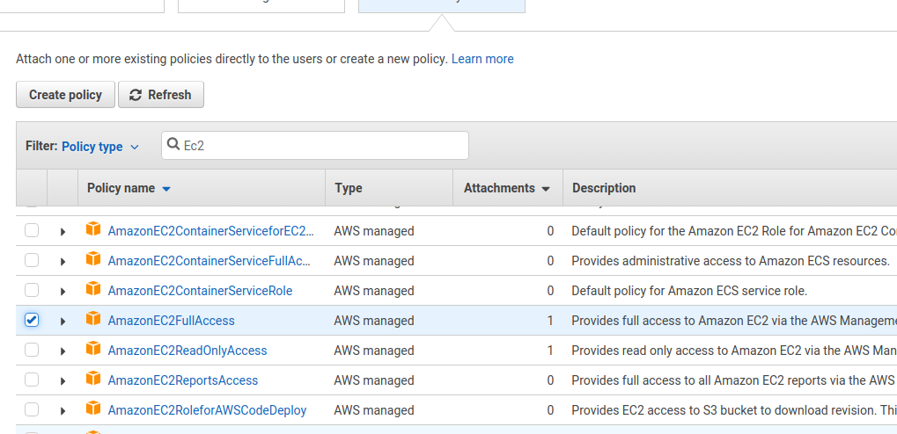

__Criando uma maquina na nuvem__

Para cada cloud existe um passo a passo diferente que pode ser encontrado na documentação oficial do Docker, mas no exemplo a seguir iremos usar a Amazon Cloud.
Vamos agora criar uma maquina na nuvem (AWS) fazendo uso da docker machine.

Vamos primeiro criar o acesso necessário:
Acesse a area de IAM da sua conta:

https://console.aws.amazon.com/iam/home?region=us-east-1#/users

Crie um usuario e adicione a opção Programatic access:


Nas permissões, adicione a opção `AmazonEC2FullAccess`:


Anote a `Access Key e a Secret Key`:


Com os dados em mãos crie um arquivo na home do seu usuaro (local) no seguinte padrão
```
~/.aws/credentials
[default]
aws_access_key_id = SUA_CHAVE
aws_secret_access_key = SEU_SECRET
```

Agora estamos aptos a usar a docker-machine:
```
docker-machine create --driver amazonec2 --amazonec2-region us-east-1 --amazonec2-vpc-id vpc-xxxxx --amazonec2-subnet-id subnet-xxxxxx workshop-docker-3
```
Vamos analisar o comando:
  - driver amazonec2: Estamos informando que vamos usar a amazon como provider
  - us-east-1: É a zona em que quero implantar a maquina (isso varia dependendo da conta)
  - amazonec2-vpc-id vpc-xxxxx: Estamos informando qual é a vpc (previamente cadastrada via console da aws) que queremos usar
  - subnet-xxxxx: Estamos informando qual é a subnet em que vamos implantar a maquina

A saída esperada é:
```
azonec2-subnet-id subnet-3e186a76 workshop-docker-ex
Running pre-create checks...
Creating machine...
(workshop-docker-ex) Launching instance...
Waiting for machine to be running, this may take a few minutes...
Detecting operating system of created instance...
Waiting for SSH to be available...
```
E no painel da aws:


Vamos agora validar:
```
sudo docker-machine ls
```
E a saida esperada é:
```
NAME                 ACTIVE   DRIVER      STATE     URL   SWARM   DOCKER   ERRORS
workshop-docker-ex            amazonec2   ACTIVE                          
```
Vamos agora remover a maquina:
```
docker-machine rm workshop-docker-ex
Are you sure? (y/n): y
```
E a saída esperada é:
```
Successfully removed workshop-docker-ex
```
E no console:


